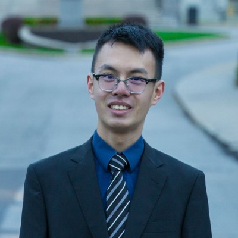

I’m **Hei Shing Helson Go**, Ph.D. in Aerospace Science and Engineering from the
**University of Toronto Institute for Aerospace Studies (UTIAS)**.

I have two major passions in research:

1. I enjoy managing and controlling multiple flying robots, aka, a multi-UAV
   system

2. I am fascinated by the problem of designing movement strategies for robots to
   help them better understand their surroundings, aka, _sensing-aware control_.

My research focused on _sensing-aware control_ for autonomous aerial vehicles,
developing _observability_ as a metric of localization quality. I applied these
concepts to enhance performance and robustness of _cooperative localization
systems_ for multi-UAV teams, contributing to multi-UAV precision and resilience
in _GNSS-denied environments_.

I specialize in:

- Cooperative localization and observability-aware control [^1]
- Mathematical measurement of system observability and uncertainty
- Large-scale software design, hardware interfacing, and flight testing for
  autonomous systems.
  - Strong ecosystem familiarity with ROS 2, PX4, etc., robotics libraries.
  - Contributor to major FOSS robotics libraries including Eigen, Ceres, and
    acados.

Beyond research, I applied engineering skills to use in the **University of
Toronto Autonomous Racing Team (UTADR)** for the Abu Dhabi Autonomous Racing
League (A2RL) in 2024. I shaped the software architecture of our racing-drone
autopilot, implemented key components such as a _Model-Predictive Contouring
Controller (MPCC)_, and maintained system reliability through comprehensive
CI/CD and automated testing.

See also: [Curriculum Vitae](/cv/)

[^1]:
    Also known as _active sensing_ or _perception aware control_ in some
    literature.
