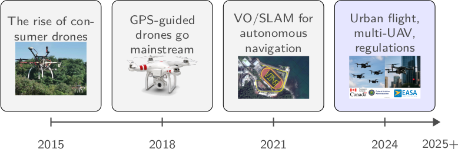
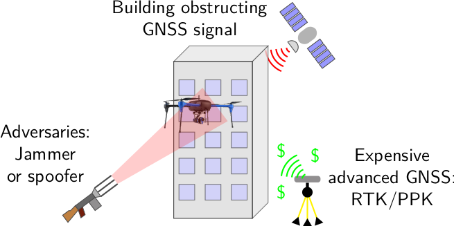
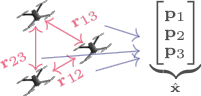
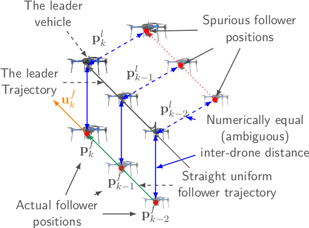
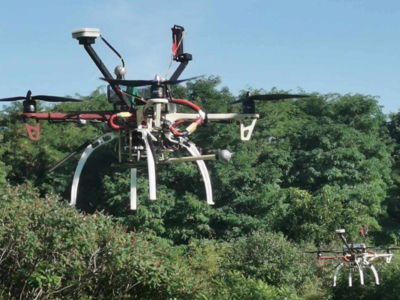
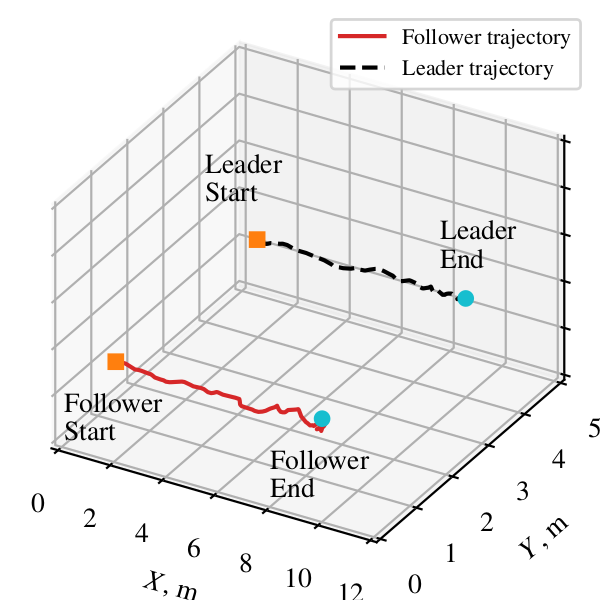
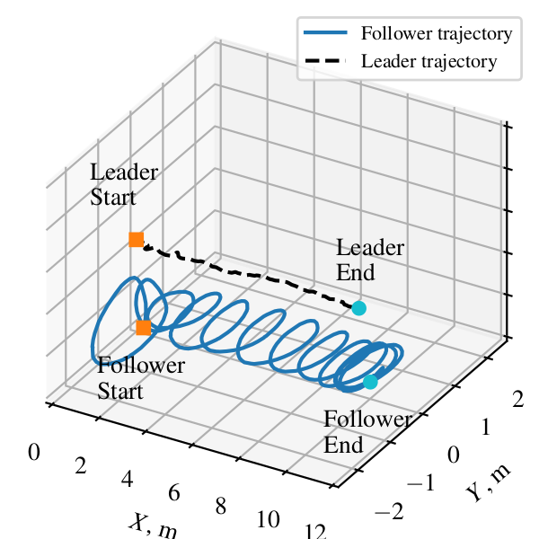

I'm **Hei Shing Helson Go**. I recently finished my Ph.D. in aerospace
engineering at the **University of Toronto Institute for Aerospace Studies
(UTIAS)**, where I spent five years teaching flying robots how to find their way
in the world. My thesis is _Cooperative Navigation and Control of UAVs in
GNSS-denied environments_.

You can find me on [LinkedIn](https://www.linkedin.com/in/hs293go/) and
[GitHub](https://github.com/Hs293Go), or reach me at
`hellston20a AT gmail DOT com`.

## The short version

I'm an engineer who is passionate about working where theory and hardware
intersect. I write a lot of code (Python, C++, and Rust), I've published my
research at the top robotics conferences, and what I care about most is building
autonomous systems that are elegant, robust, and actually work.

I'm currently open to new opportunities in research and engineering, ranging
from postdoctoral research to industrial roles in autonomy, robotics, or
aerospace.

See also: [my full CV](/cv/) and [the story behind my research](/research/).

## What I do

> **I help autonomous robots figure out where they are and how to move**
>
> _This matters especially to drones because they need to fly where GPS doesn't
> work._

To explain why, it helps to retrace the evolution of drone technology in the
last decade.

1. Around 2015, hobbyists and makers could make drones fly without too much
   difficulty.

2. By 2018, average consumers could fly their DJI drones under an open sky.

3. Soon after, research on flying drones without GPS, using computer vision,
   began to take off.

4. Today, the industry wants to fly drones inside cities, or around people, and
   regulators need drones to have a plan B when GPS fails
   

However, the technology to support that simply isn't there: GPS suffers from
multipathing, clutter, and now even spoofing, and professional solutions may not
be cost effective.

My research takes a third route towards team autonomy: **cooperative
localization.** Instead of every drone navigating alone, a team of drones
measure where they are relative to each other, exchange estimates, and jointly
work out their positions to correct drift.

Cooperating like this is cheaper than high end GPS or cameras, eliminates single
points of failure, and becomes even more accurate at close range — which is
exactly what we want for safe flight in tight formations.

> Technically, a cooperative group needs at least one or two "anchor" drones
> that can localize themselves using GPS or other means, but a cooperative group

I based my work on one principle: **the quality of cooperative localization
depends not just on estimation, but on how the drones move.** Picture two drones
flying side by side in a rigid formation, the follower faithfully mirroring the
leader. Because they stay at a fixed offset, the distance between them never
changes. So, the measurement provides no useful information, and the system
cannot tell apart true motion from spurious estimates. To localize well, the
drones must explicitly move into more _observable_ configurations.

So I design the way the drones move to extract the most information out of their
sensors. Intuitively: while a sensor tells you how you observe the world at this
instant, the math I developed tells you _how much better you'll observe the
world if you choose to move a certain way._ In real flight tests, the resulting
paths took on a distinct looping and circling motion — and that simple change in
how the drone moved improved its real-world positioning confidence by more than
two times. Designing motion to explicitly improve observability translates to
improved real-world localization.

| A straight follower path tells the drone little...                               | ...but an observability-aware path takes on a distinct looping, circling motion that reveals far more |
| -------------------------------------------------------------------------------- | ----------------------------------------------------------------------------------------------------- |
|  |        |

## Beyond the lab

I'm happiest building things that actually fly, not just equations on a
whiteboard.

- **Racing drones.** I led the University of Toronto's autonomous drone racing
  team — drones that fly themselves around a track at high speed, with no human
  pilot. We placed **6th in the world** at the 2025 Abu Dhabi Autonomous Racing
  League.
- **Delivery drones.** With Drone Delivery Canada, I worked on drones that carry
  packages dangling beneath them on a tether, keeping the load steady instead of
  letting it swing around.
- **GPS-free navigation.** With Applanix (Trimble), I built a system that lets a
  drone navigate using a laser scanner to map its surroundings as it goes —
  flying entirely on its own, with no GPS.
- **A startup.** I have explored co-founding a venture to package this kind of
  autonomy into a compact "autonomy box" that other robots can plug into.
