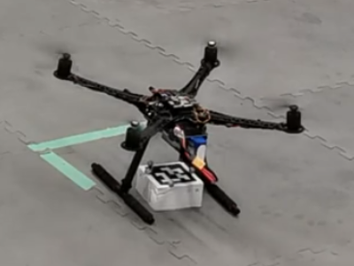
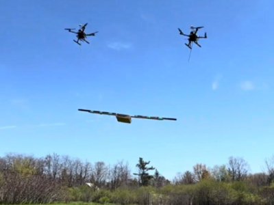
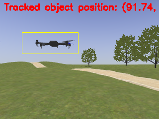
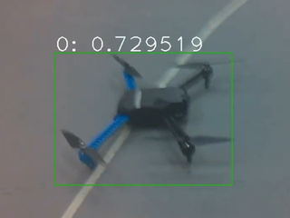
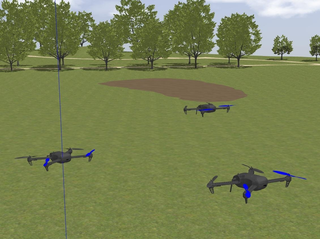
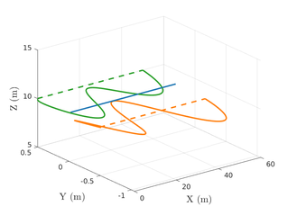
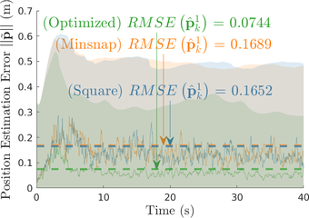

This page summarizes the timeline of my research work during my PhD, organized
by topic.

## Slung Load Transport

When I joined the FSC Lab as a M.A.Sc, student in 2019, I worked on controlling
a quadrotor slung load transport system, under the mentorship of
[Dr. Longhao Qian](https://scholar.google.com/citations?user=p2oGLVYAAAAJ&hl=en),
as part of a collaboration project with Drone Delivery Canada.

In this stage, I built a fleet of S500 quadrotor and interfaced them with the
Pixhawk 4 autopilot and Jetson Nano companion computer, enabling it to run Dr.
Qian's robust slung load control algorithm and localize the slung load using a
downward-facing camera and AprilTags.

| I built                                      | I flew                                                   |
| -------------------------------------------- | -------------------------------------------------------- |
|  |  |

I developed automation and orchestration scripts to help with experiment
management. I also developed a
[data collection software](https://github.com/FSC-Lab/ros_logger_gui) to
facilitate data collection and analysis for the project. [^1]

When research activity fully resumed after COVID, I moved on to implementing the
slung load control algorithm for outdoor flight and demonstrated it to our
collaborators at Drone Delivery Canada the next May.

[^1]:
    This software has gone unmaintained since the transition to ROS 2, but I
    believe a graphical tool to configure ROS bag recording (Writing
    `ros2 bag record ...` once is too many) is still an open problem in the ROS
    ecosystem.

## Cooperative Localization

After I transferred to the PhD program in 2020, I chose _cooperative
localization_ (CL) for multi-UAV teams in GNSS-degraded environments by the time
I took my qualifying exam.

CL is well-trodden ground in the literature for ground robots, but less so for
drones. I spent a year designing a state estimator to lets drones track each
other and share sensor data to jointly estimate their states. I explored various
means of inter-drone sensing and tracking too.

| Classical: OpenCV KCF tracker                      | AI: Yolo-v5 running on a Jetson Nano     |
| -------------------------------------------------- | ---------------------------------------- |
|  |  |

Working on the estimator showed me how the relative configuration between the
drones impact the state estimates. Subsequently, I turned my attention to
designing the team's trajectories to _maximize the quality of localization_. The
classic approach, dating back to
[Trawny and Barfoot's 2004 ICRA paper](https://doi.org/10.1109/ROBOT.2004.1308006),
treats this as minimizing a metric of the Extended Kalman Filter (EKF)
covariance.

Apart from porting the original 2D planar-robot formulation to 3D quadrotors, I
choose to address two open questions:

1. The objective function is _nonconvex and subtly discontinuous_, since it is
   built from recursive EKF updates --- a hindrance to gradient-based solvers.
2. The covariance is propagated along _noiseless_ trajectories for tractability,
   leaving open the question of whether the resulting "optimal" trajectories
   still help once real noise is reintroduced.

I addressed these questions in my extensive closed-loop simulations of a
heterogeneous-GNSS quadrotor team, where noisy sensor data fed a CL estimator
whose state estimates fed a real-time tracking controller. The optimized
trajectories were tracked faithfully and yielded the predicted reduction in
positioning uncertainty, answering Trawny's open question affirmatively. This
work was published at
[ICRA 2024](https://doi.org/10.1109/ICRA57147.2024.10610823).

| Simulated Team                                              | Optimized Trajectories                                           | Precision Improvement                                                           |
| ----------------------------------------------------------- | ---------------------------------------------------------------- | ------------------------------------------------------------------------------- |
|  |  |  |

## Observability-Aware Control
