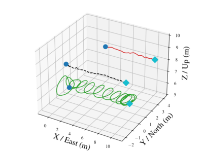
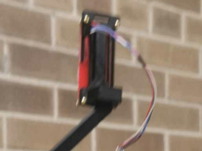

This page summarizes the timeline of my research work during my PhD, organized
by topic.

## TL;DR

My research led me to become an expert in **positioning and control of multi-UAV
systems**, with a focus on **GNSS-free localization**.

## Slung Load Transport

When I joined the FSC Lab as a M.A.Sc, student in 2019, I worked on controlling
a quadrotor slung load transport system, under the mentorship of
[Dr. Longhao Qian](https://scholar.google.com/citations?user=p2oGLVYAAAAJ&hl=en),
as part of a collaboration project with Drone Delivery Canada.

In this stage, I built a fleet of S500 quadrotor and interfaced them with the
Pixhawk 4 autopilot and Jetson Nano companion computer, enabling it to run Dr.
Qian's robust slung load control algorithm and localize the slung load using a
downward-facing camera and AprilTags.

| I built                                      | I flew                                                   |
| -------------------------------------------- | -------------------------------------------------------- |
|  |  |

I developed automation and orchestration scripts to help with experiment
management. I also developed a
[data collection software](https://github.com/FSC-Lab/ros_logger_gui) to
facilitate data collection and analysis for the project. [^1]

When research activity fully resumed after COVID, I moved on to implementing the
slung load control algorithm for outdoor flight and demonstrated it to our
collaborators at Drone Delivery Canada the next May.

[^1]:
    This software has gone unmaintained since the transition to ROS 2, but I
    believe a graphical tool to configure ROS bag recording (Writing
    `ros2 bag record ...` once is too many) is still an open problem in the ROS
    ecosystem.

## Cooperative Localization

After I transferred to the PhD program in 2020, I chose _cooperative
localization_ (CL) for multi-UAV teams in GNSS-degraded environments by the time
I took my qualifying exam.

CL means multiple robots sharing sensor data to jointly estimate their states.
It is well-trodden ground in the literature for ground robots. I spent a year
designing a state estimator for drones to carry out CL, exploring various
technologies for inter-drone sensing and tracking in the process.

| Classical: OpenCV KCF tracker                      | AI: Yolo-v5 running on a Jetson Nano     |
| -------------------------------------------------- | ---------------------------------------- |
|  |  |

Working on the estimator showed me how the relative position and orientation
between the drones impact quality of localization. Subsequently, I turned my
attention to designing the team's trajectories to **minimize the localization
uncertainty** (i.e., maximize the **precision** of the state
estimates/**confidence** in the robots' states)

The classic approach, dating back to Trawny and Barfoot's 2004 ICRA paper [^2],
treats this as minimizing a metric of the Extended Kalman Filter (EKF)
covariance. I ported the original 2D planar-robot formulation to 3D quadrotors,
then addressed on two open questions:

[^2]:
    N. Trawny and T. Barfoot, "Optimized motion strategies for cooperative
    localization of mobile robots," in IEEE International Conference on Robotics
    and Automation, 2004. Proceedings. ICRA'04. 2004, 2004, pp. 1027–1032.

1. The objective function is _nonconvex and subtly discontinuous_, since it is
   built from recursive EKF updates --- a hindrance to gradient-based solvers.
2. The covariance is propagated along _noiseless_ trajectories for tractability,
   leaving open the question of whether the resulting "optimal" trajectories
   still help once real noise is reintroduced.

I ran extensive closed-loop simulations of a heterogeneous-GNSS quadrotor team,
where noisy sensor data is fed into a CL estimator giving feedback to a
real-time tracking controller. The optimized trajectories were tracked
faithfully and realized the desired improvement in positioning uncertainty,
answering Trawny's open question affirmatively. This work was published at
[ICRA 2024](https://doi.org/10.1109/ICRA57147.2024.10610823).[^3]

[^3]:
    H. H. Go and H. H. T. Liu, "Trajectory optimization for cooperatively
    localizing quadrotor uavs," in 2024 IEEE International Conference on
    Robotics and Automation (ICRA), 2024, pp. 11796–11803.

| Simulated Team                                              | Optimized Trajectories                                           | Precision Improvement                                                           |
| ----------------------------------------------------------- | ---------------------------------------------------------------- | ------------------------------------------------------------------------------- |
|  |  |  |

## Observability-Aware Control

The CL work left a few loose ends:

- Evaluating localization uncertainty (by running a full EKF covariance
  propagation) is computationally expensive .[^3]

- Estimation uncertainty itself only _indirectly_ captures what we really care
  about: **how much do observations contribute to precision improvement.**
  - The EKF covariance is a _proxy_ for the true objective of maximizing the
    system's _observability_.
  - Covariance-based optimization results are heavily impacted by the choice of
    noise parameters, which are often hand-tuned and poorly explainable.

[^3]:
    Ironically, this forced me to learn about MATLAB's parallel computing
    toolbox and master the optimization toolbox. It also made me familiar with
    profile-driven optimization, which was a useful skill for the rest of my
    PhD.

There was a body of literature on observability-aware trajectory optimization in
adjacent areas, e.g.,
[sensor self-calibration](https://arxiv.org/abs/1604.07905). However, there was
less prior work on observability-aware methods for trajectory optimization or
connected to CL, and the few works that did exist were largely restricted to 2D
planar robots.[^4] Thus I chose to address this gap in the literature for my PhD
thesis.

[^4]:
    R. Boyinine, R. Sharma, and K. Brink, "Observability based path planning for
    multi-agent systems to aid relative pose estimation," in 2022 International
    Conference on Unmanned Aircraft Systems (ICUAS), 2022, pp. 912–921.

I made three major contributions in this area:

- I carried out a Bayesian derivation that links observability maximization
  directly to posterior covariance minimization in state estimation.
- I derived the _Short-Term Local Observability Gramian (STLOG)_, an
  approximation of the Local
  [Observability Gramian](https://en.wikipedia.org/wiki/Observability_Gramian)
  that makes use of automatically differentiated Lie Derivatives to capture
  higher-order motion-observation coupling information.
- I formulated the _Observability-Aware Optimal Control Problem_, which computes
  a motion strategy on-line to maximize the minimum eigenvalue of the STLOG.

| **Observability-Aware Trajectories**                                           | **Vehicle Team in action**         | **Inter-Drone Ranging**                 |
| ------------------------------------------------------------------------------ | ---------------------------------- | --------------------------------------- |
|  |  |  |

I carried out flight tests of the resulting _Observability-Aware Controller
(OPC)_ on a GNSS-denied outdoor testbed, where the follower drone localized
itself purely by ranging to the leader. The OPC drove the follower into a
distinctive _orbiting_ behavior around the leader's path, halving the
positioning standard deviation along the X axis and more than halving it along
the Z axis compared to a uniform-trajectory baseline. See our newest paper
[Observability-Aware Control for Quadrotor Formation Flight with Range-only Measurement](https://arc.aiaa.org/doi/full/10.2514/1.G009507)
[^5] for details:

[^5]:
    H. S. H. Go, C. L. Chong, L. Qian, and H. H. T. Liu, "Observability-aware
    control for quadrotor fo rmation flight with range-only measurement,"
    Journal of Guidance, Control, and Dynamics, pp. 1–16, 2026.

For real hardware, I built a custom UWB ranging system around the
[ESP32 UWB DWM3000](https://github.com/FSC-Lab/dwm3000_ros) and integrated it
onto a leader-follower pair of F450 quadrotors, where the follower localized
itself purely by ranging to the leader. The
[observability-aware controller](https://github.com/FSC-Lab/observability_aware_controller)
and the [UWB ranging system](https://github.com/FSC-Lab/dwm3000_ros) are both
open-sourced.
